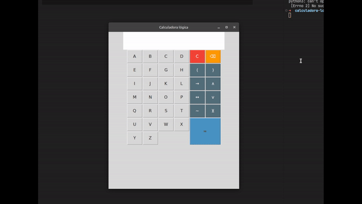

# Calculadora Lógica em Python



Uma calculadora de expressões lógicas. Projeto feito para a disciplina de matemática discreta na UNIFOR.

# Como rodar

Primeiro certifique-se de que as dependências estão instaladas

## Tkinter
```
pip install tk
```

## Truth Table Generator
```
pip install truth-table-generator
```

```
git clone https://github.com/Magoninho/calculadora-logica.git
cd calculadora-logica
python3 main.py
```

> ⚠️ Se você estiver no Windows, talvez você precise rodar o arquivo usando `python` ao invés de `python3`.


# Referências
- F. L. S. Bustamante, truth-table-generator - generating truth tables., 2019 - Available at: https://github.com/chicolucio/truth-table-generator